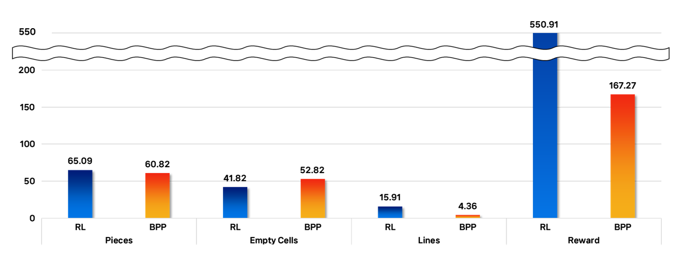
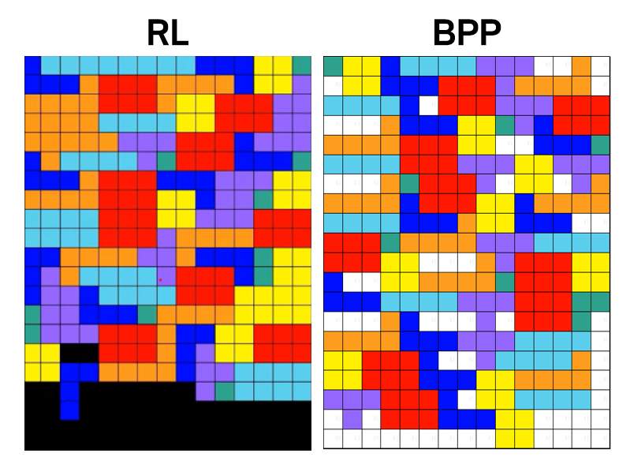

# Space-Otimization-using-RL
[Deep Learning Application] Space Otimization using Reinforcement Learning : Solve Pentomino Puzzle

## Period
23.09.12 ~ 23.11.08

## Background
According to Korea Integrated Logistics Association, after the COVID pandemic, the total revenue of the parcel delivery market continues to increase.

To handle these issues, there are many automated pick and place systems to solve the Bin Packing Problem (called BPP).

However, this method relies on heuristic algorithms, depending on the quality of heuristic functions. 

To solve these problems, we defined the situation as a 'space optimization'.

We need to place items in a limited space, deciding how to fill the space most optimally with items of various sizes and shapes.

We found a similar situation in the Pentomino puzzle, where different pieces need to fit into a given shape. 

We decided to simulate and solve this problem using reinforcement learning, reducing a 3D real-world problem to a 2D puzzle.

## Role 
| 박재현 | 장지형| 김동규 |
|:---:|:---:|:---:|
| implement baseline | impletement train code | implement environment code |

## File

* Result : result files 
  
* model : model code to solve Pentomino puzzle
  - Pentomino.py : DQN model 
  -  BPP.py : Baseline  

## Method

The environment is defined by the shape and size of the board. And we set the position of the board, so here is the front of the board and here is the behind of the board. 

Constraints include placing pieces into the board and not placing pieces in filled cells by other pieces. Also, since we don't use the z-axis, Pieces cannot be placed in a confined space.

Next, States involve the current state of the board and piece. We simulate a conveyor-like system. So, the agent only knows about the current piece.

Action refer to rotating and placing the piece. 

Reward, Considering the actual situation of putting the box in the truck, the box must be filled from the inside like this, so game will be end when piece is put the front.

And, When a line of board is filled, it means that the box was put in without any empty cells, so in this case, we were going to give a lot of reward.

And we give a positive reward for each piece, and a penalty about the game over and the number of empty cells.

We set it to give +10 points for each piece and 20 points for filling a line without any empty space.

As a negative reward, we set it to give -2 points for game over and give -10 points for the number of empty cells when the game ended. 

## Baseline
To check the performance, we set the BPP algorithm as the baseline. 

The Bin packing algorithm is an algorithm that solves the problem  of most efficiently placing a given number of items in a fixed-sized container or "bin". 

Among many heuristic functions, we chose the Best Fit algorithm of BPP as our baseline.

## Result

We try 11 comparsion test, and pieces changes in each attempt.

First, We test our RL model. In this situation, we saved used pieces including shape and order. 

And then, by this pieces information, we test BPP algorithm and compare the result.

Here we could compare the number of pieces and if the number of pieces was the same, we could see how efficiently space was used. 

The results show promise compared to existing BPP algorithms.

  
## Expected Outcomes

If parcel companies use RL for space optimization, then they can optimize item placement in warehouses and delivery trucks, making warehouse operations more efficient. 

This not only facilitates automation processes but also minimizes use of truck, reducing energy consumption and environmental impact.

This also has positive effect for workers. Efficiently placed items allow workers to perform tasks with less intensity and in a more comfortable environment.

Consumers can also expect faster and improved delivery services.

In conclusion, we can say that the application of our project can positively impact the entire process in logistics.

## Reference

https://github.com/uvipen/Tetris-deep-Q-learning-pytorch.git

Haoyuan Hu et al., Solving a New 3D Bin Packing Problem with Deep Reinforcement Learning Method (2017)
